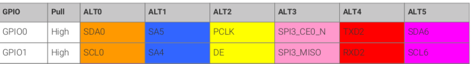
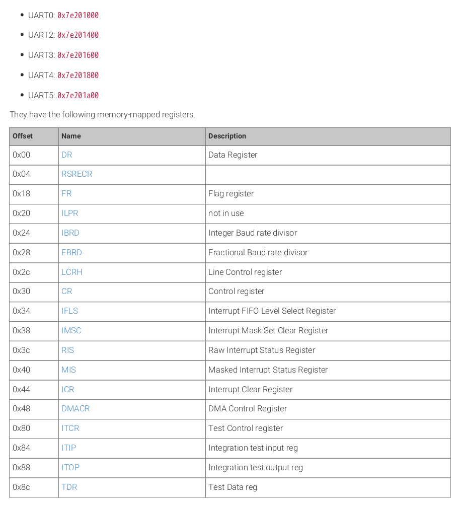
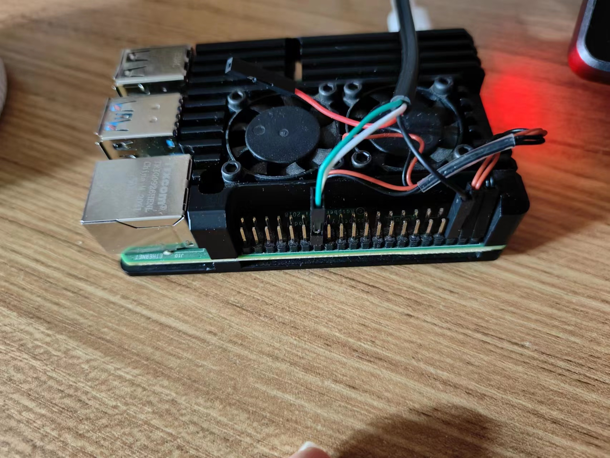
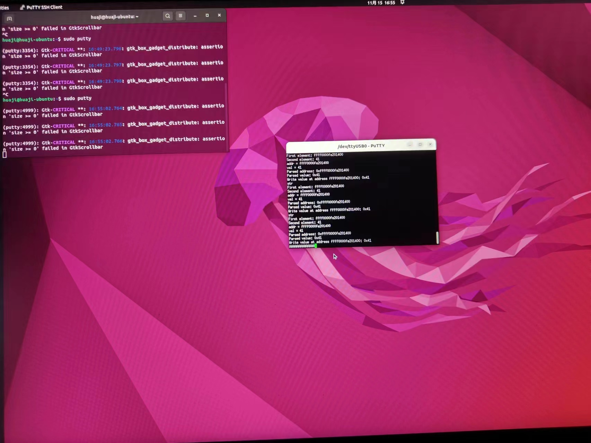

我选择了UART2口


需要把GPIO0和GPIO1改成下拉状态，功能改成ALT4启用UART0




通过查询文档得知UART2的基地址是fe201400




## 代码修改的部分

do_UART添加处理分支

```rust
"2" =>{
        let str_addr0 = "ffff0000fe200000 1B";
        let str_addr1 = "ffff0000fe200004 246c0";
        let str_addr2 = "ffff0000fe2000e4 5500000A";
        let str_addr3 = "ffff0000fe201424 1A";
        let str_addr4 = "ffff0000fe201428 3";
        let str_addr5 = "ffff0000fe20142c 70";
        let str_addr6 = "ffff0000fe201430 301";
        //调用str写入函数
        do_str(str_addr0);
        do_str(str_addr1);
        do_str(str_addr2);
        do_str(str_addr3);
        do_str(str_addr4);
        do_str(str_addr5);
        do_str(str_addr6);
        }
```

do_test修改数据写入地址为UART2的DR

```rust
fn do_test(args: &str) {
    fn delay(seconds: u64) {
     for i in 1..seconds + 1 {
         fn fibonacci_recursive(n: u64) -> u64 {
             if n == 0 {
                 return 0;
             }
             if n == 1 {
                 return 1;
             }
             return fibonacci_recursive(n - 1) + fibonacci_recursive(n - 2);
         }
         fibonacci_recursive(36 + (i % 2));
     }
 }
if args == "run" {
 loop {
     let arges = "ffff0000fe201400 41";
     do_str(arges);
     delay(4);
 }
}
}
```


## Shots

接脚



输出AAAA




