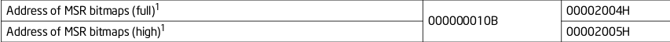

## 拦截 Guest `HLT` 指令

拦截HLT可以设置`Processor-Based VM-Execution Controls`字段中的`HLT exiting` （第7位）位来实现

可以在手册最后的 `APPENDIX B FIELD ENCODING IN VMCS` 章节中找到VMCS字段对应的编码

`Processor-Based VM-Execution Controls` 是 `0x4002`

## 拦截 Guest `PAUSE` 指令

设置 `Primary Processor-Based VM-Execution Controls` 中的 `PAUSE exiting` 位

## **拦截外部设备产生的中断，而不是直通给 Guest**

设置`Pin-Based VM-Execution Controls`中的`External-interrupt
exiting`位

## 打开或关闭 Guest 的中断

可以修改`Guest-state area`中的RFLAGS选项

## 拦截 Guest 缺页异常 (#PF)

设置 `Exception Bitmap` 中的`pagefault`异常位，#PF是14号中断所以设置第14位为1就行了

## 拦截所有 Guest I/O 指令 (x86 `IN`/`OUT`/`INS`/`OUTS` 等)

设置`Primary Processor-Based VM-Execution Controls`中的`Unconditional I/O exiting`位

## *只拦截 Guest 对串口的 I/O 读写 (I/O 端口为 `0x3f8`)

intel手册对于`I/O bitmap`的描述：

**26.1.3 Instructions That Cause VM Exits Conditionally** 

设置`Primary Processor-Based VM-Execution Controls`中的`Use I/O bitmaps`位

设置`Address of I/O bitmap A`和`Address of I/O bitmap B`的物理页地址

把A中4k物理页的第0x3f8位设置成1

## 拦截所有 Guest MSR **读写**

intel手册中对于MSR读写部分的描述：

**26.1.3 Instructions That Cause VM Exits Conditionally** 

intel手册中对于MSR bitmaps部分的描述：

**APPENDIX B FIELD ENCODING IN VMCS**

设置`Primary Processor-Based VM-Execution Controls`中的`Use MSR bitmaps`位（第28位）

设置`Address of MSR bitmaps`字段的物理页地址，把整个页的位全填1

## *只拦截 Guest 对 `IA32_EFER` MSR 的写入

IA32_EFER的MSR编号是`0xC0000080`

先把msrbitmap置0,再往msrbitmap的第 `3072*8+80`位写入1

## *只拦截 Guest 对 `CR0` 控制寄存器 `PG` 位 (31 位) 的写入

intel手册中对`Guest/Host Masks`的描述

对`CR0 guest/host mask`字段的第31位写入1,其他位置0

## *如果要在单核 hypervisor 中交替运行两个 vCPU，应该如何操作 VMCS？

可以像内核中的任务切换一样调度Guest的每一个vcpu

### 设置VMCS中对vcpu调度的相关字段和位

**1. 设置拦截HLT指令，HLT指令的作用是让cpu休眠，Guest的内核执行了HLT指令就代表让vcpu陷入休眠模式，可以把这个vcpu移出调度器，等到Guest的下一个中断执行再加入调度器**

本来想到拦截Guest的时钟中断的时机来做vcpu上下文切换，但是想到这个方案存在一个问题，如果Guest陷入死循环，并且Guest通过设置RFLAG禁用了中断，那Host用于运行Guest的这个cpu核心不就一直处于Guest中了吗。于是我觉得vt-x应该会为Guest提供一个类似于内核中时钟中断的机制

通过询问GPT得知vt-x有一个`VMX-Preemption Timer`的机制可以设置vcpu的时间片，当vcpu运行到一定时间后会产生一个reson为`VMX-preemption timer expired`的vmexit，在这个时机里触发上下文切换

intel手册中描述`VMX-Preemption Timer`的节：

**2. 设置`Pin-Based VM-Execution Controls`中的`Activate VMX-preemption timer`位，设置Guest state中的` VMX-preemption timer value`为vcpu分配时间片长度**

## 触发vcpu上下文切换时，对VMCS的操作

我参考了kvm中的 `vmx_vcpu_run` 函数

Host需要保存恢复整个`Guest State`里的内容，以及整个`Control Fields`里的内容

