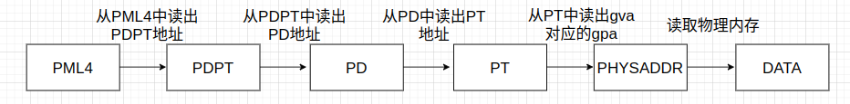

## 假设一个 Hypervisor 中运行有 4 个 Guest VM，每个 Guest VM 中运行有 10 个应用 (需要 10 个 Guest 页表)，请问在用影子分页方式实现内存虚拟化时，Hypervisor 共需维护多少份影子页表？

**Guest都不是双页表OS的情况下Hypervisor 共需维护44份影子页表**， Guest系统中init进程和idle循环共需要1个页表，10个应用需要10个页表，一个Guest VM需要维护11份页表

**Guest都是双页表OS的情况下Hypervisor 共需维护88份影子页表**， Guest系统中init进程和idle循环共需要2个页表，10个应用需要20个页表，一个Guest VM需要维护22份页表

## 假设在 Guest OS 中启用了 4 级页表，Guest 的一次访存 (使用 Guest 虚拟地址) 会导致多少次内存访问？（使用 4 级嵌套页表实现内存虚拟化；假设 TLB 全部失效；假设不出现缺页或 EPT Violation）

会导致25次内存访问

GUEST执行一次访存，在GUEST视角下的过程如下分为5个步骤：

每次读都会在EPT中执行5次相似的步骤，总共执行了5x5=25次内存访问

## 简述：如果要改成按需分配内存，应该在代码上作出哪些修改？

可以参考linux kernel中mmap分配内存的PageFault机制

- **处理 EPT Violation**： 在发生EPT violation 时，代表Guest在试图访问还未分配的物理内存地址。需要检查访问的物理地址并为分配物理内存，然后更新EPT页表项，执行`INVEPT`
- **Allocation on write**：只有GUEST要写这个物理地址的数据的时候，才是GUEST真正需要这块内存的时候。GUEST读操作触发EPT Violation的时候就给对应的EPT页表项的物理地址分配一个固定全是0的物理地址，**属性分配为读+执行（EPT页表项的执行属性在intel手册中解释为instruction fetch）**，GUEST写操作触发EPT Violation的时候HOST就真正分配一块物理内存，把对应的EPT页表项的物理地址更新为这块物理内存的地址，**属性更新为读写执行**

