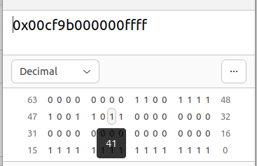

## 结合之前学习到的知识，解释 Guest BIOS 核心代码中 `prot_gdt` 和 `prot_gdt_desc` 都是什么内容。

### prot_gdt_desc

prot_gdt_desc的内容是被lgdt指令设置为GDTR寄存器的内容

limit是prot_gdt的大小，base是prot_gdt的起始地址

### prot_gdt

定义了2个32位GDT项

GDT第一个项为空

**code segment**

定义了一个代码段，**属性为读写执行**，代码注释有误，这个项的RW位是1代表可读可写

基址是0,大小是4G

**data segment**

定义了一个数据段，比代码段少了一个执行属性

## 修改代码，使分配给 Guest OS 的内存容量从 16 MB 增加到 32 MB。

修改`apps/hv/src/x64.rs`中的`GUEST_PHYS_MEMORY_SIZE`为`0x200_0000`

## 简述：如果要使 NimbOS OS 被加载的地址从`0x20_0000`更改到其他地址，需要做哪些修改？

修改`apps/hv/src/x64.rs`中的`GUEST_ENTRY`

修改`apps/hv/guest/nimbos/bios/boot16.S`中第31行内核入口点

